# Mermaid Diagram Patterns Reference

mermaid-diagram-specialist 에이전트의 다이어그램 유형별 상세 예시 모음.

## Flowchart

### Syntax

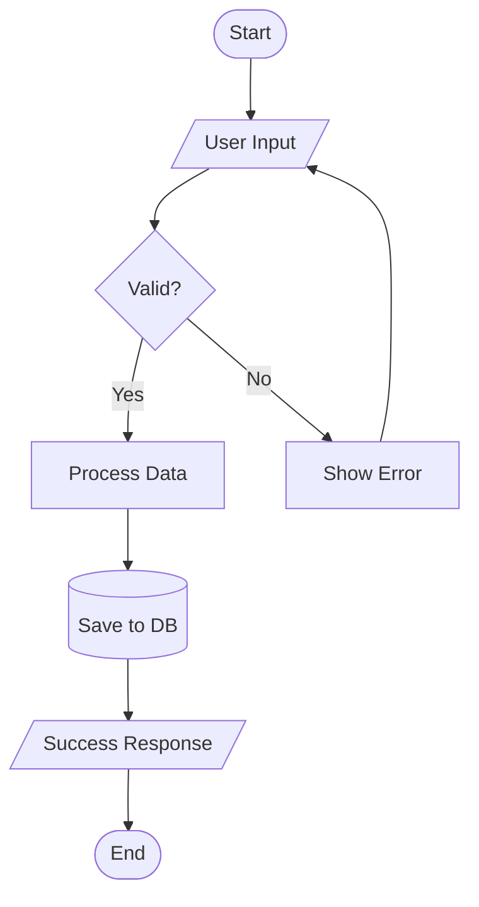

### Node Shapes

- `[Rectangle]` - Process step
- `([Rounded])` - Start/End
- `{Diamond}` - Decision
- `[/Parallelogram/]` - Input/Output
- `[(Database)]` - Data storage
- `((Circle))` - Connector

### Direction Options

- `TD` - Top to Down
- `LR` - Left to Right
- `BT` - Bottom to Top
- `RL` - Right to Left

### Example - Booking Flow

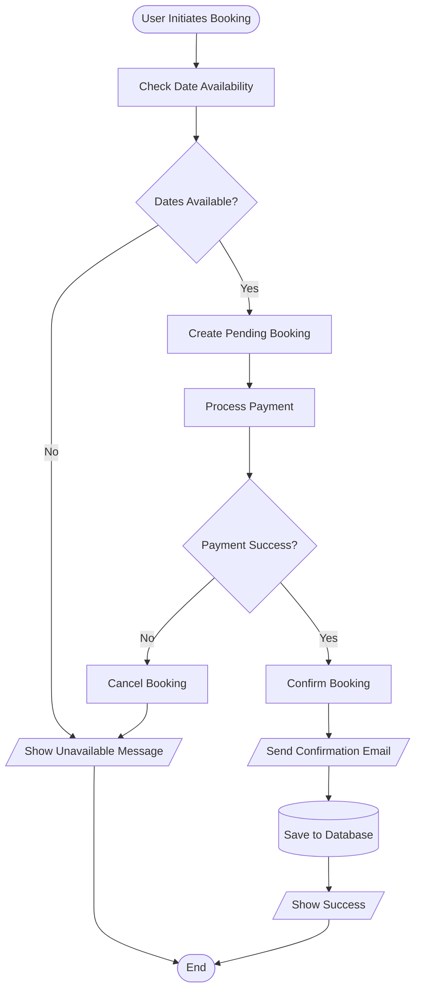

## Sequence Diagram

### Syntax

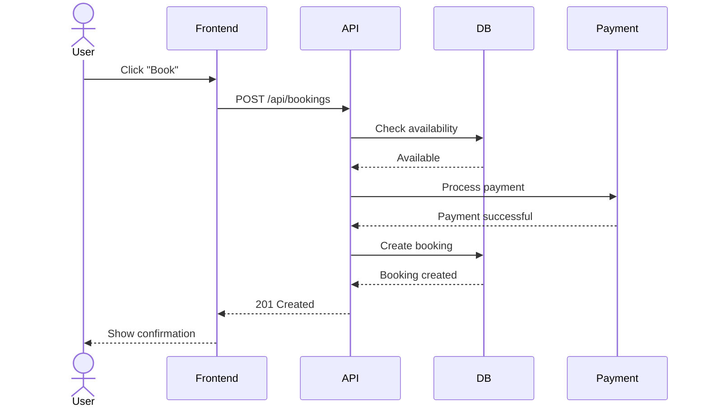

### Participant Types

- `actor` - Human user
- `participant` - System/Service
- `database` - Database

### Arrow Types

- `->` - Solid line (synchronous)
- `-->` - Dotted line (response)
- `->>` - Solid arrow (async message)
- `-->>` - Dotted arrow (async response)

### Example - Authentication Flow

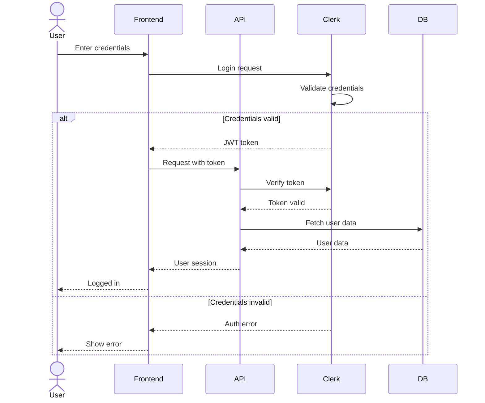

## ERD (Entity Relationship Diagram)

### Syntax

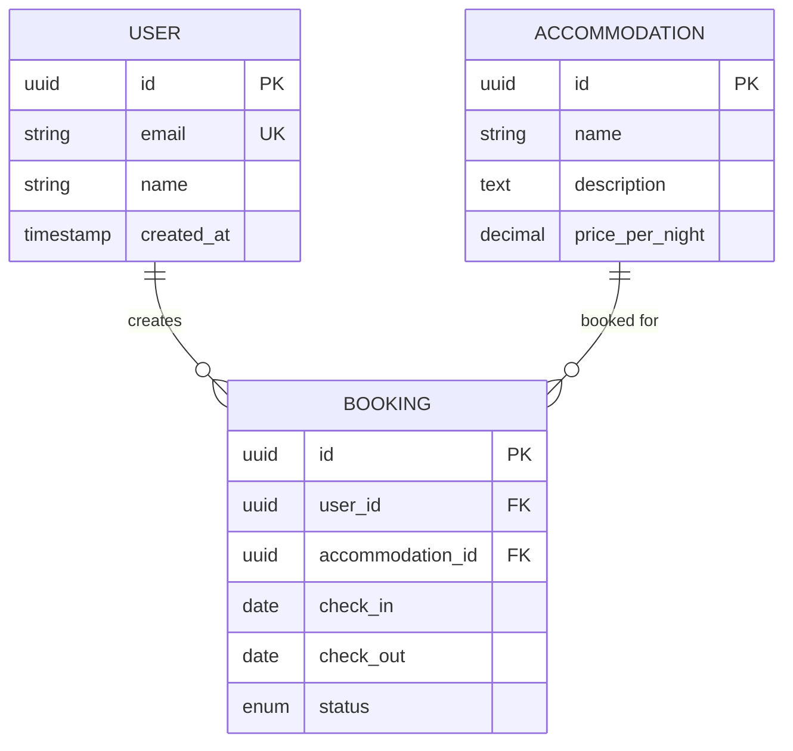

### Relationship Types

- `||--||` - One to one
- `||--o{` - One to many
- `}o--o{` - Many to many
- `||--o|` - One to zero or one

### Cardinality Symbols

- `||` - Exactly one
- `o|` - Zero or one
- `}o` - Zero or more
- `}|` - One or more

### Example - Full ERD

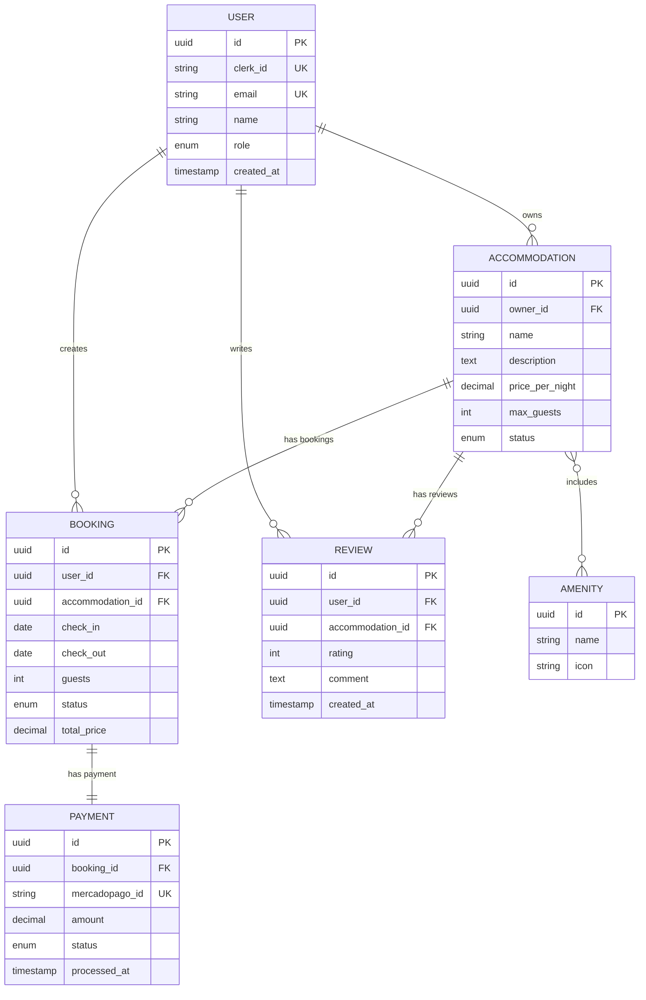

## C4 Architecture Diagrams

### Context Level (System in environment)

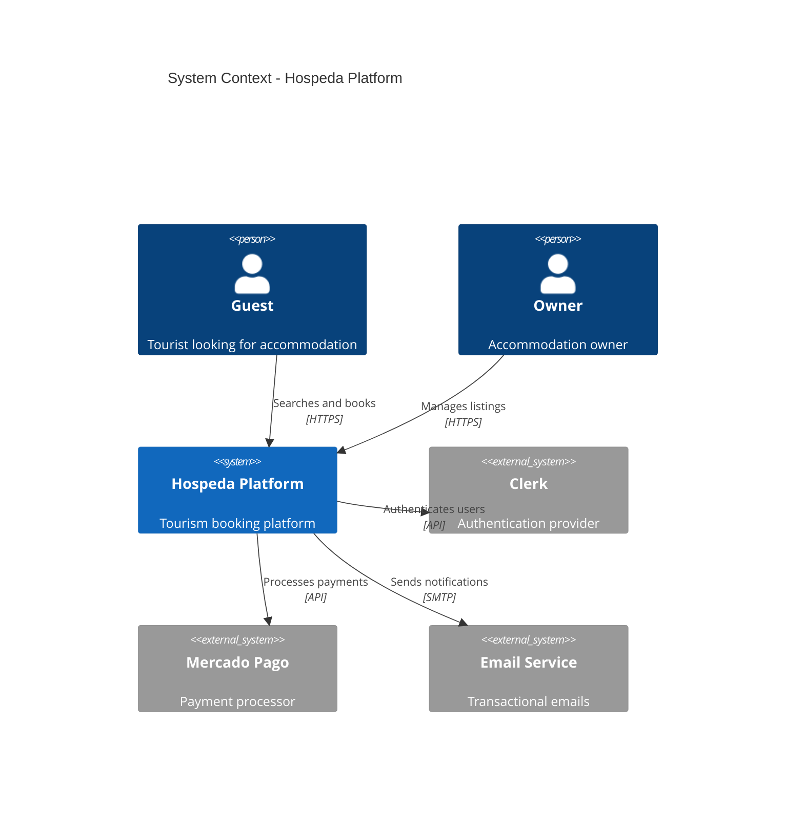

### Container Level (Applications and data stores)

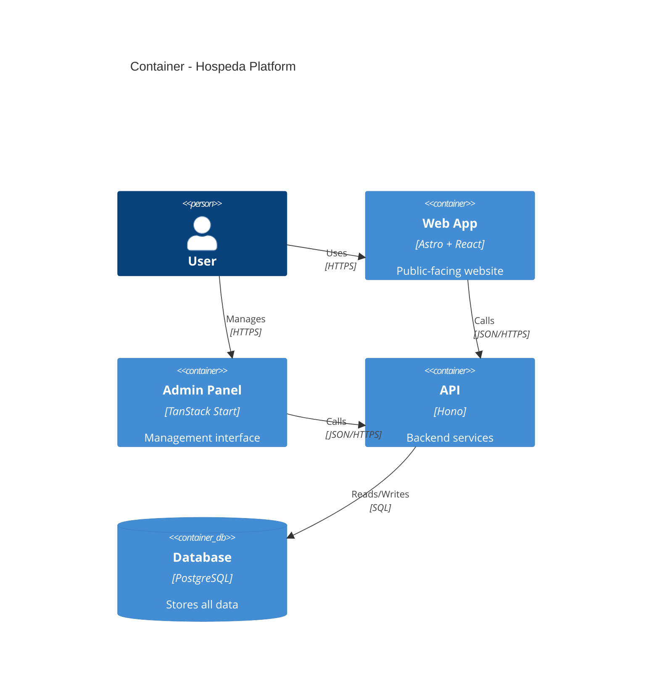

### Component Level (Internal structure)

```mermaid
C4Component
    title Components - API Application

    Container(api, "API", "Hono")

    Component(routes, "Routes", "Hono Router", "HTTP endpoints")
    Component(services, "Services", "Business Logic", "Domain operations")
    Component(models, "Models", "Data Access", "DB operations")
    Component(middleware, "Middleware", "Cross-cutting", "Auth, logging, errors")

    Rel(routes, middleware, "Uses")
    Rel(routes, services, "Calls")
    Rel(services, models, "Uses")
    Rel(models, db, "Queries")
```

## State Diagram

### Syntax

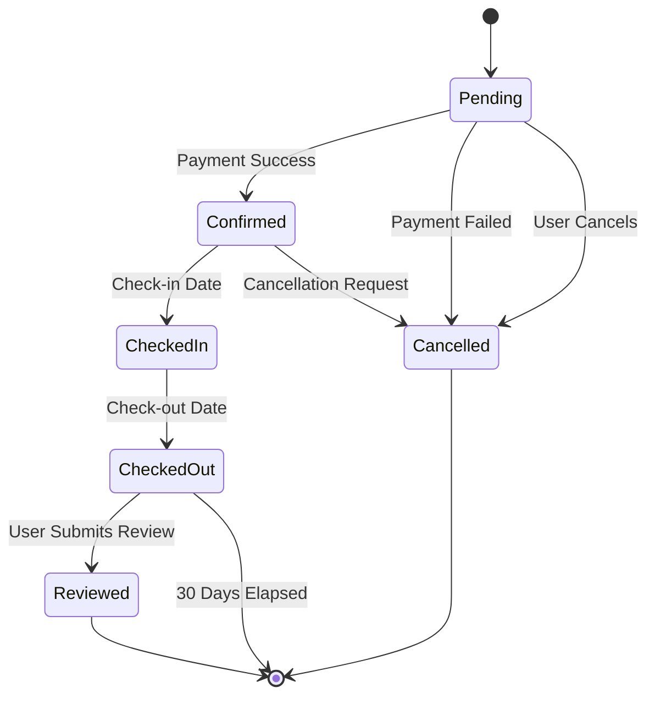

### Example - Booking Lifecycle

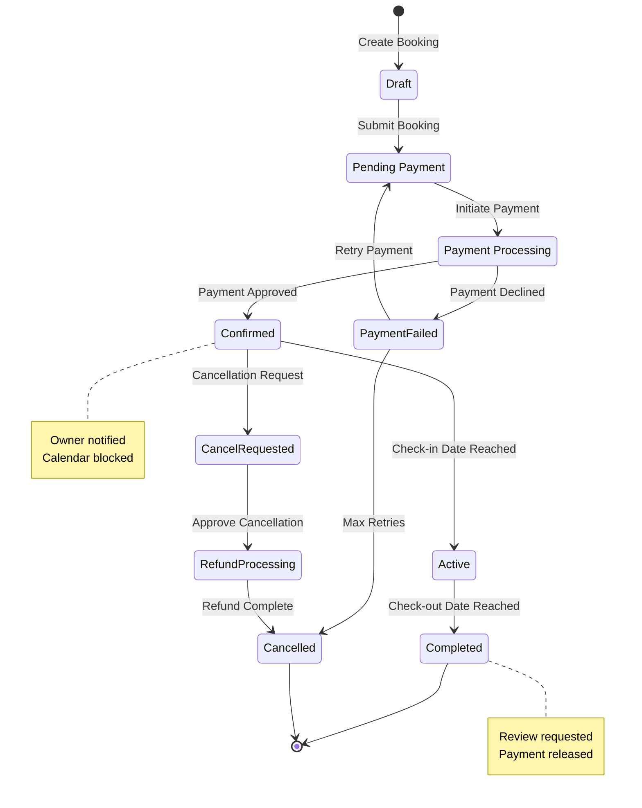

## Styling and Customization

### Theme Application

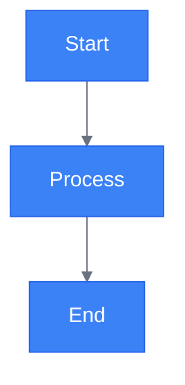

### Class Styling

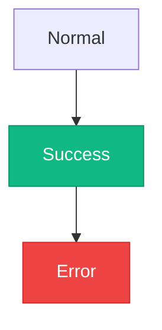

## Common Patterns

### API Request Flow

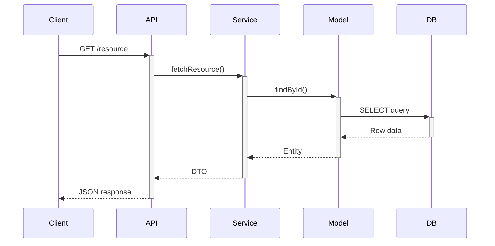

### Error Handling Flow

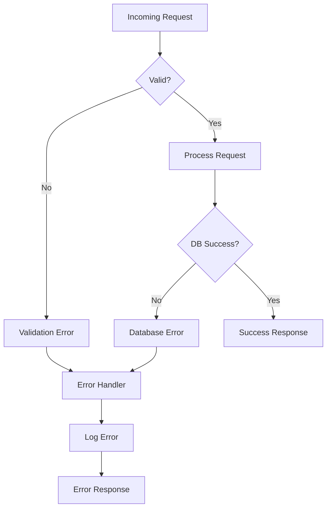
