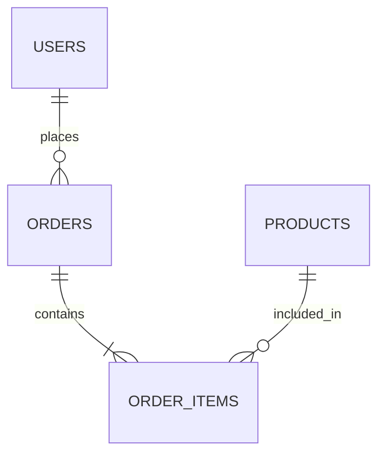

# 스키마 설계 워크플로우

데이터베이스 스키마 설계의 전체 흐름과 각 단계를 설명합니다.

---

## 왜 스키마 설계가 먼저인가?

```
운영(어떻게?) → 데이터(뭘 쌓을?) → 화면(뭘 보여줄?) → 스키마 → API → 코드
```

도메인 전문가가 "어떤 업무를 누가 수행하고, 무슨 데이터를 쌓는지"를 분석한 후,
그 데이터를 **어떤 구조로 저장할지** 결정하는 것이 스키마 설계입니다.

스키마가 먼저 확정되면:
- API의 Request/Response 스키마가 DB 구조에서 자연스럽게 도출됨
- 섹션 파일에서 각 구현 단위가 담당하는 테이블이 명확해짐
- verify 단계에서 실제 DB와 설계를 대조 검증할 수 있음

---

## 전체 흐름

```
도메인 전문가(Step 9) → 스키마 설계(Step 14) → API 스펙(Step 15) → 섹션 분리(Step 17)
```

| 단계 | 입력 | 출력 | 담당 |
|------|------|------|------|
| 도메인 분석 | claude-spec.md | domain-process-analysis.md, domain-technical-analysis.md | 도메인 전문가 (Step 9) |
| 스키마 설계 | 도메인 분석 + claude-plan.md | **claude-db-schema.md** | 스키마 서브에이전트 (Step 14) |
| API 스펙 | claude-plan.md + claude-db-schema.md | claude-api-spec.md | API 서브에이전트 (Step 15) |
| 섹션 분리 | claude-plan.md + api-spec + db-schema | sections/*.md | 섹션 서브에이전트 (Step 17) |

---

## 각 단계 상세

### Step 1: 엔티티 추출 (from domain-process-analysis.md)

업무 흐름표에서 테이블 후보를 도출합니다:

| 추출 대상 | 규칙 | 예시 |
|-----------|------|------|
| 명사 → 테이블 | 반복되는 비즈니스 개체 | 사용자, 주문, 상품 |
| 동사 → 관계 테이블 | "A가 B를 한다" 패턴 | 주문하다 → orders |
| 역할 → 권한 테이블 | CRUD 권한 차이 | roles, permissions |
| 상태 → ENUM/컬럼 | 상태 전이 존재 | PENDING → PAID → SHIPPED |
| 입출력 → 컬럼 | 기능의 입력/출력 필드 | 이름, 이메일 → users 컬럼 |

### Step 2: 관계 분석 (from CRUD 권한)

| 패턴 | 관계 | 구현 |
|------|------|------|
| "A가 여러 B" | 1:N | FK on B side |
| "A와 B가 서로 여러" | M:N | Junction table |
| "A 안의 A" | Self-Reference | parent_id FK |
| "A 또는 B에 달린 C" | Polymorphic | 별도 FK + CHECK |

### Step 3: 정규화 결정

| 데이터 특성 | 결정 |
|-----------|------|
| 트랜잭션 (주문, 결제) | 3NF 유지 |
| 조회 (대시보드, 리포트) | 역정규화 허용 |
| 역정규화 시 | **반드시 주석으로 이유 기록** |

### Step 4: ERD 생성 (Mermaid)



### Step 5: DDL 작성

대상 DB 방언으로 SQL 작성. DB-First 원칙 적용:
- PostgreSQL이면 JSONB, RLS, BIGSERIAL 활용
- MySQL이면 별도 테이블 정규화, AUTO_INCREMENT 사용

### Step 6: 인덱스 전략

접근 패턴 분석 → DB별 인덱스 유형 결정:
- FK 컬럼 → B-Tree (필수)
- JSONB 검색 → GIN (PostgreSQL)
- 전문검색 → GIN/FULLTEXT
- 조건부 → Partial Index

### Step 7: 설계 검증 (체크리스트)

- [ ] 모든 테이블에 PK
- [ ] 모든 관계에 FK 제약조건
- [ ] FK에 인덱스
- [ ] 적절한 데이터 타입 (DECIMAL for 금액)
- [ ] Audit 컬럼 (created_at, updated_at)
- [ ] 설계 근거 테이블 작성

---

## 산출물: claude-db-schema.md 형식

```markdown
# Database Schema

## Target Database
- DB: PostgreSQL 16
- 이유: JSONB + RLS 활용, Supabase 호스팅

## ERD (Mermaid erDiagram)
## DDL (PostgreSQL 방언)
## 설계 근거 테이블
## 인덱스 전략
## 마이그레이션 노트
```

---

## 사용 에이전트/스킬

| 리소스 | 역할 |
|--------|------|
| **database-schema-designer** (에이전트) | 설계 규칙, DB-First 프로세스, 검증 체크리스트 |
| **database-schema-designer** (스킬) | 상세 참조 (타입, 인덱스, 제약조건, 마이그레이션) |
| **database-mysql** (에이전트) | MySQL 특화 구현 (InnoDB, Flyway, FULLTEXT) |
| **database-postgresql** (에이전트) | PostgreSQL/Supabase 특화 (RLS, JSONB, GIN/GiST) |

---

## 관련 문서

| 문서 | 내용 |
|------|------|
| [workflow-guide.md](workflow-guide.md) | 전체 파이프라인 (설계 → 구현 → QA → 배포) |
| [AGENTS.md](../AGENTS.md) | 에이전트/스킬 전체 목록 |
| [skills/zephermine/SKILL.md](../skills/zephermine/SKILL.md) | 젭마인 24단계 워크플로우 |
| [skills/database-schema-designer/SKILL.md](../skills/database-schema-designer/SKILL.md) | 스키마 설계 상세 참조 |
